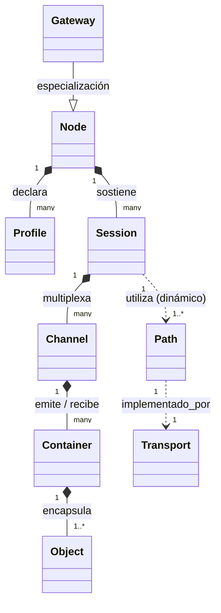

# IPVN7 — Línea Base Arquitectónica (Baseline)
**Documento:** `IPVN7_ARCHITECTURE_BASELINE.md`  
**Versión Conceptual:** IPVN7-0 (Libro en Blanco)  
**Estado:** HIPÓTESIS ARQUITECTÓNICA / FASE DE INVESTIGACIÓN  
**Fecha:** 2026-10-02  
**Clasificación Epistémica:** DOCUMENTO DE DISEÑO E HIPÓTESIS (No demostrado en código)

---

## 1. Definición de IPVN7

**IPVN7** es un proyecto de investigación y diseño experimental enfocado en explorar una arquitectura de red orientada a **estructuras de comunicación, identidades desacopladas, canales lógicos, sesiones resilientes y objetos tipificados**, operando sobre infraestructuras de transporte existentes.

> [!IMPORTANT]
> **Delimitación Ontológica:**  
> - **NO es un protocolo terminado ni un estándar de facto.**  
> - **NO es una VPN, ni una blockchain, ni un protocolo de chat, ni un sistema operativo.**  
> - **NO es un reemplazo inmediato de la pila TCP/IP global.**  
> - Es una **hipótesis arquitectónica** sujeta a refutación experimental continua bajo el axioma: *Comprender antes de implementar; medir antes de afirmar.*

---

## 2. Problema que Intenta Resolver

La arquitectura clásica de Internet (Modelo de Dartmouth / Berkeley Sockets sobre IPv4/IPv6 + TCP/UDP) ata la comunicación a una tupla rígida:
$$\text{Socket} = (\text{IP Origen}, \text{Puerto Origen}, \text{IP Destino}, \text{Puerto Destino}, \text{Protocolo})$$

Esta vinculación estructural genera fricciones conocidas en redes modernas:
1. **Sobrecarga de Semántica en la Dirección IP:** La dirección IP cumple dos funciones en conflicto:
   - **Localizador topológico:** Dónde está la interfaz en el grafo de conmutación.
   - **Identificador de host:** Quién es el participante.  
   Cuando un dispositivo cambia de interfaz (Wi-Fi $\leftrightarrow$ 5G/Celular) o atraviesa un NAT/CGNAT, su localizador cambia, rompiendo el socket y destruyendo la sesión lógica a menos que capas complejas a nivel de aplicación (ej. tokens de reconexión) lo reconstruyan artificialmente.
2. **Proliferación Redundante de Protocolos de Aplicación:** Cada necesidad de intercambio (chat, telemetría IoT, streaming, transferencia masiva, llamadas RPC) diseña su propio protocolo ad-hoc con su propio framing, handshakes, heartbeat, autenticación y serialización, multiplicando la superficie de ataque y el esfuerzo de implementación.
3. **Falta de Conciencia de Estructura en la Red:** Para la red tradicional, los datos son únicamente una secuencia de bytes planos (*bytestream*) o datagramas opacos. La red no distingue si transporta un fragmento crítico de control o un byte de relleno multimedia, obligando a multiplexaciones complejas a nivel de usuario.
4. **Acoplamiento de Camino y Estado:** Las sesiones se interrumpen si el camino físico falla, incluso si existen rutas alternativas viables a través de gateways, intermediarios o interfaces secundarias.

---

## 3. Problemas que NO Intenta Resolver

Para acotar estrictamente el dominio de investigación y evitar la sobrecomplejidad, IPVN7 **NO** intenta resolver:
1. **La física del medio de transmisión:** No define capas físicas (L1), frecuencias de radio, modulación óptica ni framing L2 ethernet.
2. **Reemplazo del enrutamiento de tránsito inter-dominio (BGP/AS):** No pretende sustituir las tablas globales de conmutación de los proveedores de telecomunicaciones.
3. **Criptografía propia o primitiva:** No diseñará nuevos cifradores simétricos, funciones hash ni curvas elípticas. Utilizará primitivas consolidadas y estandarizadas (ej. ChaCha20-Poly1305, AES-GCM, Ed25519, X25519).
4. **Gestión de consenso distribuido global o inmutabilidad de almacenamiento:** No incluye mecanismos de minería, árboles de prueba de trabajo/participación ni bases de datos distribuidas universales.
5. **Universalidad de rendimiento sin compensaciones (*No Free Lunch*):** No promete menor latencia o mayor throughput absoluto que UDP o TCP puro en caminos sin perturbación; cada abstracción estructural añade un costo medible en overhead que debe ser justificado cuantitativamente.

---

## 4. Principios Rectores

1. **Desacoplamiento Estricto:** La identidad de la comunicación no depende del localizador de red ni del camino físico temporal.
2. **Economía de Emisión (*La red escucha más de lo que grita*):** Prohibición del broadcast continuo e indiscriminado como mecanismo primario de descubrimiento.
3. **Separación de Capas por Necesidad, no por Dogma:** Toda capa en la pila debe justificar su existencia demostrando qué problema resuelve y qué coste en bytes/latencia impone. Si una capa no aporta valor mensurable, **se elimina**.
4. **Agrupación y Tipificación Estructural (Object-First):** El transporte maneja unidades delimitadas de información (*Objects*) encapsuladas en contenedores de transporte (*Containers*), sin interpretar su semántica interna de aplicación.
5. **Autonomía Heterogénea (Conciencia de Perfil):** Un servidor de centro de datos con ancho de banda gigabit y alimentación continua no puede ser tratado bajo las mismas presunciones operacionales que un sensor IoT con batería de celda de moneda.
6. **Refutabilidad (*Reality Principle*):** La IA y los diseñadores tienen la obligación metodológica de declarar fallida una hipótesis si los experimentos demuestran que es inferior, más compleja o ineficiente frente a las soluciones existentes.

---

## 5. Arquitectura Conceptual

IPVN7 postula una jerarquía estratificada desde la intención declarativa de la aplicación hasta el medio físico:

```text
┌────────────────────────────────────────────────────────┐
│                   APLICACIÓN (App)                     │
│         Expresa intención, semántica y datos           │
└───────────────────────────┬────────────────────────────┘
                            │
┌───────────────────────────▼────────────────────────────┐
│                    PERFIL (Profile)                    │
│      Define restricciones, capacidades y políticas     │
└───────────────────────────┬────────────────────────────┘
                            │
┌───────────────────────────▼────────────────────────────┐
│                    CANAL (Channel)                     │
│       Vía lógica temática/prioritaria (ej. CONTROL)    │
└───────────────────────────┬────────────────────────────┘
                            │
┌───────────────────────────▼────────────────────────────┐
│                    SESIÓN (Session)                    │
│    Contexto criptográfico e identidades lógicas (A↔B)  │
└───────────────────────────┬────────────────────────────┘
                            │
┌───────────────────────────▼────────────────────────────┐
│                 CONTENEDOR (Container)                 │
│         Framing, secuencia, integridad y control       │
└───────────────────────────┬────────────────────────────┘
                            │
┌───────────────────────────▼────────────────────────────┐
│                     OBJETO (Object)                    │
│      Unidad lógica de datos estructurada y atómica     │
└───────────────────────────┬────────────────────────────┘
                            │
┌───────────────────────────▼────────────────────────────┐
│                      CAMINO (Path)                     │
│        Enrutamiento lógico y selección de tramos       │
└───────────────────────────┬────────────────────────────┘
                            │
┌───────────────────────────▼────────────────────────────┐
│                  TRANSPORTE (Transport)                │
│       Adaptador concreto (UDP, QUIC, TCP, WireGuard)   │
└───────────────────────────┬────────────────────────────┘
                            │
┌───────────────────────────▼────────────────────────────┐
│                   RED FÍSICA (Network)                 │
│           Infraestructura IP subyacente / L2           │
└────────────────────────────────────────────────────────┘
```

---

## 6. Entidades Fundamentales

| Entidad | Definición Conceptual | Atributos Mínimos Propuestos |
| :--- | :--- | :--- |
| **Node** | Participante direccionable en el espacio IPVN7. | `Node_ID` (Criptográfico), `Capabilities`, `Active_Profiles`. |
| **Profile** | Declaración de características del dispositivo o contexto. | `Profile_Type` (Server, IoT, Mobile), `Max_MTU`, `Energy_Class`. |
| **Channel** | Tubería lógica temática y priorizada dentro de la relación. | `Channel_ID`, `Priority`, `Reliability_Mode`, `Flow_Control`. |
| **Session** | Estado de asociación y acuerdo criptográfico entre dos nodos. | `Session_ID`, `Local_Node_ID`, `Peer_Node_ID`, `Keys`, `Path_Binding`. |
| **Container** | Unidad atómica de transferencia a través del transporte. | `Container_Header`, `Sequence_Num`, `Auth_Tag`, `Payload`. |
| **Object** | Mensaje, fragmento o estructura con significado para el usuario. | `Object_Type`, `Object_ID`, `Content_Encoding`, `Payload_Bytes`. |
| **Path** | Secuencia de saltos o punto final físico/lógico del transporte. | `Path_ID`, `Endpoint_Address`, `RTT_Estimate`, `Path_MTU`. |
| **Gateway** | Nodo con visibilidad en dos o más dominios topológicos. | `Gateway_ID`, `Supported_Transports`, `Translation_Rules`. |

---

## 7. Relaciones entre Entidades



- **Un Nodo** puede sostener concurrentemente múltiples **Sesiones** con distintos pares.
- **Una Sesión** multiplexa uno o más **Canales** diferenciados por prioridad y fiabilidad.
- **Una Sesión** está vinculada lógicamente a uno o más **Caminos (Paths)** activos o de respaldo; el cambio de Camino no destruye la Sesión.
- **Un Contenedor** transporta uno o múltiples **Objetos** (agrupación para mitigar overhead).

---

## 8. Estados

### Estados de la Sesión (`Session State`)
```text
[INIT] ──(Handshake Init)──> [AUTHENTICATING] ──(Handshake Confirm)──> [ACTIVE]
                                                                          │
  ┌───────────────────────────────────────────────────────────────────────┘
  ├──(Path Degraded)──────> [MIGRATING_PATH] ──(Re-bind OK)──> [ACTIVE]
  ├──(Idle Timeout)───────> [DORMANT]        ──(Keepalive)────> [ACTIVE]
  └──(Explicit Close/Err)─> [TERMINATED]     ──(Cleanup)──────> [*]
```

### Estados del Canal (`Channel State`)
```text
[CLOSED] ──(Channel Open)──> [OPEN] ──(Backpressure)──> [THROTTLED]
                               │                             │
                               │<──(Flow Credit)─────────────┘
                               └──(Close Signal)──────> [DRAINING] ──> [CLOSED]
```

---

## 9. Flujo de Comunicación (Ejemplo Típico de Envío de Objeto)

1. **Intención:** La Aplicación solicita enviar un objeto de telemetría al nodo B.
2. **Perfil & Canal:** La pila evalúa el perfil local (`PROFILE_IOT`) y selecciona el canal adecuado (`Channel_ID: TELEMETRY`, prioridad baja, entrega no garantizada o garantizada según política).
3. **Validación de Sesión:** Verifica si existe una sesión activa y autenticada con B. Si no existe, se ejecuta el protocolo de apertura de sesión.
4. **Encapsulamiento del Objeto:** Se estructura el `Object` (tipo, metadatos, carga útil).
5. **Empaquetado en Contenedor:** Se inserta el objeto en un `Container`, calculando secuencia, cabecera mínima y etiqueta de autenticación e integridad (AEAD).
6. **Despacho por Path:** El motor de caminos selecciona el camino activo óptimo (ej. UDP sobre enlace celular) respetando el MTU efectivo.
7. **Recepción y Demultiplexado:** El nodo B verifica la integridad del contenedor, extrae la sesión, rutea al canal correspondiente y entrega el objeto des-serializado a la aplicación receptora.

---

## 10. Identidad

Se propone una investigación basada en **Identidades Criptográficas Desacopladas**:

* **Identidad del Dispositivo / Nodo (`Node Identity`):**  
  Clave pública o hash criptográfico de clave pública (ej. `NodeID = SHA-256(Ed25519_PubKey)`).  
  *Inmutable respecto a la dirección de red.*
* **Identidad de Sesión (`Session ID`):**  
  Número pseudoaleatorio o derivación criptográfica temporal de alta entropía acordada en el handshake. Protege contra seguimiento o correlación persistente de tráfico por terceros.
* **Identidad de Canal (`Channel ID`):**  
  Entero corto (ej. 8 o 16 bits) para optimizar el encabezado dentro de la sesión.
* **Identidad de Objeto (`Object ID`):**  
  Opcional, utilizado cuando se requiere confirmación de entrega selectiva, fragmentación o idempotencia.

> [!NOTE]
> **Hipótesis a comparar en experimentos:**  
> Identificador simple (UUID) vs Clave Criptográfica Directa (HIP/Cryptographic Generated Addresses) vs Identificadores Descentralizados (DID).

---

## 11. Enrutamiento (Routing)

IPVN7 debe distinguir entre:
1. **Enrutamiento Interno (Overlay):** Decisión de cómo alcanzar un `Node_ID` remoto a través de una malla local, nodos directos o gateways conocidos.
2. **Enrutamiento de Transporte (Underlay):** Delegado por completo a la red subyacente (rutas IPv4/IPv6 locales o de Internet).

El enrutamiento no debe reinventar protocolos como OSPF o BGP. Debe investigar:
- **Conmutación directa punto a punto:** Cuando ambos nodos conocen su endpoint de transporte.
- **Enrutamiento asistido por Gateway / Relay:** Cuando los nodos están tras NAT simétricos o en dominios de red inconexos.

---

## 12. Path (Caminos Dinámicos y Movilidad)

Un `Path` encapsula:
- Endpoint origen y destino de transporte (`Transport_Type`, `Local_Socket`, `Remote_Socket`).
- Estadísticas operacionales: RTT móvil, jitter, tasa de pérdida de paquetes.
- Estado: `ACTIVE`, `PROBING`, `STANDBY`, `FAILED`.

### Propiedad de Movilidad e Independencia de Camino:
Si un nodo migra de IP (ej. Wi-Fi desconectado, activación de 4G/5G):
1. El nodo emite un frame de re-asociación de camino (`PATH_MIGRATE`) autenticado con la clave de sesión existente.
2. El par valida la firma/MAC de la sesión y actualiza el `Path` sin interrumpir las transferencias de los canales lógicos ni exigir re-autenticación de aplicación.

---

## 13. MTU (Maximum Transmission Unit) y Fragmentación

La red existente impone restricciones físicas ineludibles:
- Ethernet estándar: 1500 bytes.
- IPv6 mínimo obligatorio: 1280 bytes.
- Túneles/VPNs (WireGuard, GRE, VXLAN): ~1420 bytes.

### Directrices de MTU en IPVN7:
1. **Path MTU Discovery (PMTUD) Dinámico:** El contenedor mide activamente el MTU efectivo del camino sin depender exclusivamente de mensajes ICMP (que son habitualmente filtrados en Internet).
2. **Fragmentación a Nivel de Objeto vs a Nivel de Contenedor:**  
   - Preferencia por fragmentación de **Objetos** (capa superior consciente del dato) antes que fragmentación de Contenedores de transporte, evitando los fallos y riesgos de amplificación típicos de la fragmentación IP.
3. **Tamaño Mínimo Garantizado:** Definir un MTU de contenedor seguro por defecto (ej. 1200 bytes) para garantizar paso universal sin fragmentación L3 sobre UDP/IPv6.

---

## 14. Descubrimiento (Discovery)

**Axioma:** *La red escucha más de lo que grita.*

### Mecanismos a contrastar:
1. **Descubrimiento Local Silencioso:** Anuncios periódicos mínimos o respuesta estricta a consultas dirigidas (*Directed Probe / Response*).
2. **Descubrimiento Basado en Registro (Directory / Gateway):** Los nodos en redes de infraestructura se registran ante un Gateway local; las consultas se resuelven contra la caché del Gateway en lugar de inundar el dominio L2 con broadcast.
3. **Cero-Broadcast en Tránsito:** En redes WAN o externas, el descubrimiento es exclusivamente por resolución criptográfica o punto de encuentro conocido (*Rendezvous Point*).

---

## 15. Gateway (Puertas de Enlace y Fronteras de Dominio)

El `Gateway` cumple tres roles cruciales:
1. **Traductor de Transporte:** Puente entre transportes heterogéneos (ej. nodo que solo habla Bluetooth/L2 crudo hacia transporte UDP/IPv6 WAN).
2. **Punto de Relevo (Relay) para NAT Traversal:** Asistencia en la intermediación de paquetes cuando no es posible establecer conectividad directa P2P (mecanismo tipo STUN/TURN, pero integrado a la sesión IPVN7).
3. **Escudo de Aislamiento:** Filtro perimetral que impide que dispositivos restringidos (ej. sensores industriales) queden expuestos directamente a tráfico hostil no autenticado.

---

## 16. Perfiles (Profiles)

El concepto de perfil modula el comportamiento del protocolo sin romper la interoperabilidad del formato base:

```text
┌─────────────────────────┬─────────────────────────┬─────────────────────────┐
│     PROFILE_SERVER      │     PROFILE_MOBILE      │     PROFILE_SENSOR      │
├─────────────────────────┼─────────────────────────┼─────────────────────────┤
│ Enlaces Gbps continuos  │ Enlaces con jitter/cambio│ Batería crítica         │
│ MTU grande              │ MTU dinámico            │ MTU estricto (mínimo)   │
│ Buffer en RAM masivo    │ Buffer intermedio       │ Cero buffer persistente │
│ Criptografía de alto    │ Re-negociación rápida de│ Criptografía ligera     │
│ rendimiento (hardware)  │ caminos (migración)     │ Sleep cycles prolongados│
└─────────────────────────┴─────────────────────────┴─────────────────────────┘
```

---

## 17. Seguridad

**Regla de Oro:** *No diseñar criptografía propia.*

- **Confidencialidad e Integridad:** Cifrado autenticado con datos asociados (AEAD) mediante primitivas estándar de la industria (ChaCha20-Poly1305 o AES-256-GCM).
- **Intercambio de Claves:** Protocolos basados en Diffie-Hellman efímero autenticado (Noise Protocol Framework o esquema tipo TLS 1.3 / WireGuard Handshake).
- **Protección contra Replay:** Contadores de secuencia estrictos de 64 bits por sesión y ventana deslizante de validación.
- **PFS (Perfect Forward Secrecy):** Rotación periódica de claves de sesión efímeras sin reinicio de la conexión lógica.
- **Criptografía Post-Cuántica (PQC):** A evaluar únicamente como opción experimental de encapsulación de claves (ej. ML-KEM / Kyber) midiendo el impacto de la sobrecarga de tamaño en el MTU.

---

## 18. Transporte (Transport Adapters)

IPVN7 se apoya en capas de transporte estándar como sustrato físico:
1. **IPVN7 sobre UDP:** Sustrato principal recomendado para entornos generales (baja latencia, traversal de NAT, multiplexación directa).
2. **IPVN7 sobre QUIC:** Aprovechamiento de control de congestión maduro y multiplexación cuando se requiera fiabilidad estricta sin reconstruir la rueda.
3. **IPVN7 sobre Raw L2 / Ethernet:** Para entornos embebidos locales sin pila IP completa.
4. **IPVN7 sobre TCP:** Fallback estricto de emergencia para redes corporativas restrictivas que bloquean todo tráfico no-TCP puerto 443.

---

## 19. Compatibilidad y Coexistencia

- **Diseño sin Bandera Verde Universal:** IPVN7 asume que vivirá dentro del ecosistema TCP/IP durante toda su existencia experimental.
- **Encapsulamiento Limpio:** Todo datagrama IPVN7 sobre UDP debe poder atravesar routers, switches, middleboxes y firewalls comerciales convencionales sin requerir modificaciones en el firmware de la red física.

---

## 20. Rendimiento y Métricas

El rendimiento se considerará una **variable empírica sujeta a medición**, no una promesa publicitaria.

### Métricas Obligatorias a Evaluar:
1. **Overhead de Encabezados (Header Tax):** Cantidad de bytes adicionales por paquete comparado con UDP plano, TCP y QUIC.
2. **Latencia de Establecimiento (Handshake Latency):** Tiempo y número de RTTs hasta que el primer objeto útil es entregado.
3. **Costo de Computación (CPU / RAM):** Ciclos de CPU por megabyte procesado y footprint de memoria para perfiles embebidos vs servidores.
4. **Penalización por Migración de Camino (Handover Time):** Tiempo requerido para retomar tráfico tras el cambio de dirección IP de transporte.
5. **Comportamiento ante Pérdida y Desorden:** Degradación del throughput frente a tasas controladas de pérdida (0.1%, 1%, 5%).

---

## 21. Modelo de Amenaza

Se adopta el modelo formal de amenaza para delimitar las aserciones de seguridad:

```text
AMENAZA ────────> ATACANTE ────────> CAPACIDAD ────────> OBJETIVO ────────> DEFENSA PREVISTA
```

| Vector de Amenaza | Atacante | Capacidad del Atacante | Objetivo | Mitigación Arquitectónica |
| :--- | :--- | :--- | :--- | :--- |
| **Eavesdropping pasivo** | Espía de red en ruta | Lectura de datagramas UDP en tránsito | Capturar datos o perfiles de tráfico | Cifrado AEAD integral de Contenedores y metadatos. |
| **Tampering / Inyección** | Intermediario malicioso (MITM) | Modificar bytes o inyectar datagramas espurios | Corromper objetos o inducir fallos de parser | Autenticación criptográfica por tag AEAD en cada Container; descarte silente. |
| **Ataque de Replay** | Atacante en red | Capturar datagramas válidos y reenviarlos | Provocar acciones repetidas o desincronización | Número de secuencia monótono + ventana anti-replay. |
| **Amplificación DoS** | Atacante externo spoofing IP | Enviar peticiones pequeñas con IP origen falsa | Inundar a una víctima con respuestas | El handshake exige prueba de retorno de dirección antes de emitir respuestas mayores al estímulo. |
| **Secuestro de Camino (Path Hijack)** | Atacante en red local | Forjar frames de migración de camino | Desviar el tráfico hacia el atacante | Toda solicitud de migración requiere firma o token derivado de la clave de sesión autenticada. |

---

## 22. Alternativas Existentes y Análisis Comparativo

| Tecnología | Enfoque Principal | Ventajas Consolidadas | Limitaciones frente a la Visión IPVN7 |
| :--- | :--- | :--- | :--- |
| **TCP/IP Clásico** | Stream confiable por socket rígido | Universal, hardware acelerado, maduro | Acoplado a tupla de IPs, sin concepto nativo de objeto, migración costosa. |
| **QUIC (RFC 9000)** | Transporte multiplexado cifrado sobre UDP | Handshake rápido, migración de conexión, control de congestión probado | Orientado a streams/datagramas web; no maneja identidades desacopladas de dispositivo ni canales de perfil heterogéneo. |
| **WireGuard** | VPN de capa 3 con criptografía estricta | Mínimo código, alta velocidad, roaming nativo (cryptokey routing) | Es un túnel L3 punto a punto plano de paquetes IP; no gestiona objetos, canales lógicos ni perfiles heterogéneos de aplicación. |
| **SCTP (RFC 4960)** | Transporte multihoming y multistreaming | Multihoming nativo, sin bloqueo de cabeza de línea entre streams | Pobre soporte en Internet (bloqueado por middleboxes), no está cifrado por defecto, sin semántica de objetos. |
| **Named Data Networking (NDN)** | Red centrada en información (ICN) | Seguridad en el dato, enrutamiento por nombre sin IP | Requiere cambio radical de routers intermedios, problemas serios de escalabilidad de tablas de nombres y privacidad de consultas. |
| **Libp2p** | Modularidad P2P para aplicaciones distribuidas | Múltiples transportes, multiplexores y seguridad pluggable | Diseñado para aplicaciones peer-to-peer complejas; overhead considerable, configuración pesada para nodos ultra-restringidos. |

---

## 23. Decisiones Preliminares de Diseño

1. **Decisión D-01:** Utilizar **UDP** como el sustrato de transporte por defecto para la investigación inicial en laboratorio.
2. **Decisión D-02:** Adoptar el marco de trabajo **Noise Protocol Framework** (patrón Noise_IK o Noise_XX) para el diseño del acuerdo de claves e inicialización de sesión, reutilizando ingeniería formalmente verificada.
3. **Decisión D-03:** Mantener el encabezado de contenedor en formato binario estructurado y compacto (Little-Endian o Big-Endian normalizado), prohibiendo el uso de JSON, XML o texto plano en el plano de transporte.
4. **Decisión D-04:** Adoptar el principio de **descarte silente**: datagramas no autenticados, malformados o fuera de ventana se descartan sin responder mensajes de error que sirvan como oráculos a un atacante.

---

## 24. Hipótesis Científicas Iniciales

- **H-01 (Hipótesis de Desacoplamiento):**  
  *Es posible mantener una sesión de comunicación criptográficamente continua y funcional entre dos nodos a través de un cambio completo de dirección IP y puerto del transporte subyacente sin que las aplicaciones asociadas registren desconexión.*
- **H-02 (Hipótesis de Eficiencia Estructural):**  
  *La multiplexación de múltiples tipos de comunicación (chat, archivos, telemetría) sobre una estructura unificada de Objetos y Canales impone un overhead de bytes menor que la suma de ejecutar múltiples pilas de aplicación independientes sobre sockets separados.*
- **H-03 (Hipótesis de Conciencia de Perfil):**  
  *Un protocolo consciente de capacidades heterogéneas (Profiles) reduce el consumo de energía y procesamiento en nodos restringidos en comparación con el uso de pilas pesadas de propósito general (ej. HTTP/2 sobre TLS).*
- **H-04 (Hipótesis de Descubrimiento Silencioso):**  
  *Un esquema de descubrimiento dirigido basado en consultas amortizadas genera un tráfico de señalización en reposo significativamente menor que los protocolos tradicionales basados en broadcast/multicast continuo (mDNS, SSDP).*

---

## 25. Preguntas Abiertas Críticas

1. **¿Es indispensable la capa `Channel`?**  
   *¿Aporta un valor real separar canales lógicos dentro de una sesión, o la multiplexación por tipo de objeto es suficiente y más simple?*
2. **¿Cuál es el coste real del encabezado mínimo?**  
   *¿Se puede empaquetar la cabecera de Container + Session + Object en menos de 24–32 bytes para no castigar paquetes pequeños de telemetría?*
3. **¿Cómo se resuelve el control de congestión entre canales de distinta prioridad?**  
   *Si el canal de archivos satura el camino, ¿cómo evitamos que demore el canal de control sin reimplementar un planificador complejo en cada nodo?*
4. **¿Cómo mitigar la amplificación si el handshake es 0-RTT o 1-RTT?**  
   *¿Qué mecanismo de cookies o puzzles de costo computacional impedirá que un nodo falso use a un gateway IPVN7 como reflector DoS?*
5. **¿Qué ocurre si la red subyacente bloquea UDP?**  
   *¿Debe existir un transporte secundario TCP automático y cuál es su impacto en el diseño del estado?*

---

## 26. Experimentos Necesarios (Roadmap Inicial de Validación)

Para verificar si estas hipótesis se sostienen antes de cualquier implementación de producción, se plantean los siguientes experimentos controlados:

1. **EXP-IPVN7-01: Sobrecarga Teórica y Comparativa de Framing (Framing Overhead Benchmark):**
   - Comparación matemática byte a byte del framing propuesto frente a UDP, TCP/TLS, QUIC y WireGuard.
2. **EXP-IPVN7-02: Simulación de Migración de Camino (Path Mobility Handover):**
   - Medición del tiempo de recuperación y paquetes perdidos al forzar una mutación de socket de transporte en un enlace activo.
3. **EXP-IPVN7-03: Validación de Integridad y Resistencia a Manipulación (Tampering Rejection):**
   - Inyección de bits corruptos en Contenedores para verificar la detección y descarte estricto al 100% de los casos.
4. **EXP-IPVN7-04: Tráfico de Señalización en Reposo (Discovery Quiescence Test):**
   - Medición de paquetes emitidos durante 1 hora en reposo comparando el modelo silencioso frente a mDNS estándar.
5. **EXP-IPVN7-05: Viabilidad en Perfil Ultra-Restringido:**
   - Análisis de memoria estática y ciclos necesarios para verificar si la cabecera y el AEAD caben en un microcontrolador típico (ej. ARM Cortex-M0/M4 con < 32KB RAM).

---

> [!CAUTION]
> **Condición de Parada:**  
> Este documento representa la base conceptual teórica. **No se procederá a implementar código ni prototipos funcionales** hasta que este documento haya sido evaluado críticamente y se hayan formalizado el mapa de investigación (`IPVN7_RESEARCH_MAP.md`) y el plan experimental detallado (`IPVN7_EXPERIMENT_PLAN.md`).
